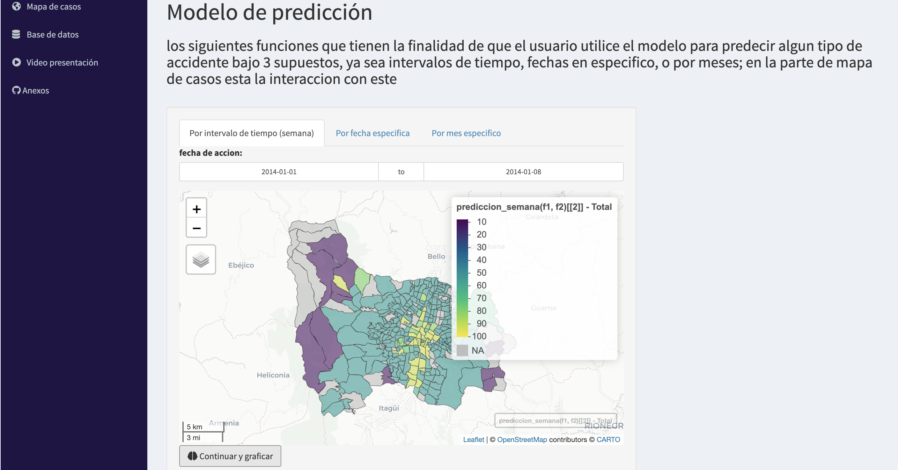

```{r setup, include=FALSE}
knitr::opts_chunk$set(echo = F)
```

# Introducción

El presente trabajo es un reporte técnico sobre la predicción de incidentes viales en la Ciudad de Medellin a partir de datos históricos de accidentes reportados por la Secretaría de Movilidad de la Alcaldía de Medellín cuya fecha de publicación fue el 28 de Diciembre del 2012 y su última modificación el 06 de Marzo del 2021. De acuerdo a la Organización Mundial de la Salud, al año se presenta la pérdida de más de 1,5 millones de vidas en siniestros viales, estos se han convertido en una problemática social por el daño que producen no solo en las familias sino también en la comunidad. En el caso de la ciudad de Medellín, según cifras de la Alcaldía de Medellín y la Secretaría de Movilidad, entre los años 2014 y 2020 se presentaron aproximadamente más de 200.000 incidentes viales. 

El análisis predictivo agrupa una variedad de técnicas estadísticas de modelización, aprendizaje automático y minería de datos que analiza los datos actuales e históricos reales para hacer predicciones acerca del futuro o acontecimientos no conocidos, con este trabajo pretendemos aportar  a la prevención de accidentes dre tránsito en la Ciudad, implementado un modelo que permitan predecir los incidentes viales  en la Ciudad de Medellín que puedan ocurrir en determinado día, semana o mes, el cual puede ser utilizado por los organismos encargados de desarrollar planes y estrategias para prevenir acidentes, para el caso de Medellin la Secretaria de Movilidad .

```{r warning=F, message=F, results='hide'}
#librerias
library(tidyverse)
library(dplyr)
library(kableExtra)
library(ggplot2)
library(lubridate)
```

# Exploración base de datos

En primer lugar, preparamos la base de datos para obtener buenos resultados a la hora de implementar los modelos. Al explorar la base de datos se encontraron algunos errores de digitación los cuales fueron debidamente corregidos, también se creó una nueva base de datos a partir de la publicada en MEdata con las variables que consideramos más pertinentes para el desarrollo del modelo. 
Encontramos en las observaciones de la variable Barrio que 18395 accidentes registrados   se ubican en el municipio de Heliconia y por ende no corresponden a la ciudad de Medellín, debido a esto decidimos eliminar esos datos y también aquellos registros faltantes de información en las variables Barrio, Comuna y Localización.Cabe resaltar que con esa base de datos de 251189 observaciones se hizo  el análisis descriptivo, pero para el modelo modificamos esa base y se eliminaron los registros de la columna BARRIO que presentaban números y no nombres, ya que nuestro mapa no graficaba esos puntos y por falta de tiempo no nos fue posible imputar dichas observaciones.

```{r}
setwd("/Users/andremac/Downloads/Tae-AccidentalidadMed")
datos <- readRDS("bases_datos/df.rds")
head(datos,50) %>%kbl() %>%  kable_styling(font_size = 12) %>%
  kableExtra::scroll_box(width = "100%", height = "200px")
```


Encontramos en las observaciones de la variable Barrio que 19344 accidentes registrados   se ubican en el municipio de Heliconia y por ende no corresponden a la ciudad de Medellín, debido a esto decidimos eliminar esos datos ya que era muy dificil buscar la coordenada de más de 19.000 registros de los cuales la gran mayoria no tenían registros en las variabales de BARRIO,COLUMNA y NÚMERO DE COMUNA


```{r out.width="72%"}
Accidentes_viales= c("Localizados","No localizados por falta de información")
porcentaje= c(0.92,0.077)
dw=data.frame(Accidentes_viales,porcentaje)

ggplot(dw,aes(x=2, y=porcentaje, fill=Accidentes_viales))+
  geom_bar(stat = "identity",
           color="white")+
    geom_text(aes(label=porcentaje),
              position=position_stack(vjust=0.5),color="white",size=6)+
  coord_polar(theta = "y")+
  scale_fill_manual(values=c("salmon","steelblue"))+
    theme_void()+
     labs(title = "Porcentaje de accidentes localizados y no localizados", caption = "Figura 1") +
  theme (plot.title = element_text(family="Comic Sans MS",
                                   size=rel(1.5),  
                                   vjust=2,  
                                   face="bold", 
                                   color="black", 
                                   lineheight=1.0))+
  theme(plot.title = element_text(hjust = 0.5))
  xlim(0.5,2.5)
```
 
En base a los datos en la figura 2 se evidencia que en el año 2018 se presentaron más accidentes que el resto de años.


```{r out.width="60%"}
z=data.frame(table(datos$AÑO))

gr2 <- ggplot(z, aes(x=Var1, y=Freq, fill=Var1)) + geom_bar(stat="identity",position = "dodge")+ labs(title="Accidentes por año", caption = "Figura 2",x = "Año", y = "Cantidad de accidentes")+
  theme (plot.title = element_text(family="Comic Sans MS",
                                  size=rel(1.5),  
                                  vjust=2,  
                                  face="bold", 
                                  color="black", 
                                  lineheight=1.0)) + 
  theme(plot.title = element_text(hjust = 0.5))+
  scale_fill_brewer(palette = "Set3")+
    theme(axis.ticks = element_blank(),axis.title = element_blank(),legend.position="none") 

gr2
```
Con respecto a la frecuencia de accidentes registrados por mes entre 2014 y 2020 se puede observar en la figura 3 que en el mes en que más se presentan incidentes viales es en Agosto, esto puede ser explicado porque en ese mes se lleva a cabo la Feria de Flores en la Ciudad de Medellin y por ende circulan más vehículos y peatones de lo normal. Asi mismo, podemos notar que el mes de abril es donde se han presentado menores accidentes.


```{r out.width="60%"}
mes=data.frame(table(datos$MES))

ggplot(datos, aes(x = MES)) + 
       geom_histogram(color = "white", fill = "coral",binwidth=1)+
  scale_x_continuous(breaks = seq(1,12,1))+
  theme (plot.title = element_text(family="Comic Sans MS",
                                  size=rel(1.5),  
                                  vjust=1,  
                                  face="bold", 
                                  color="black", 
                                  lineheight=1)) + 
  labs(title="Frecuencia de accidentes por mes", caption = "Figura 3", x= "Mes", y = "Cantidad de accidentes")+
  theme(plot.title = element_text(hjust = 0.5))
```

En la figura 4, se puede ver que los dias que con mayor frecuencia se presentaron accidentes fueron los martes y los viernes, seguido de los jueves.


```{r out.width="60%"}

dias=format(datos$FECHA_ACCIDENTE,"%A")
s=table(dias)

tu=as.data.frame(s)
gr5 <- ggplot(tu, aes(x=dias, y=Freq, fill=dias)) + geom_bar(stat="identity",position = "dodge")+ labs(title="Accidentes por dia de la semana", caption = "Figura 4",x = "Dia", y = "Cantidad de accidentes")+coord_flip()+
  theme (plot.title = element_text(family="Comic Sans MS",
                                  size=rel(1.5),  
                                  vjust=2,  
                                  face="bold", 
                                  color="black", 
                                  lineheight=1.0)) + 
  theme(plot.title = element_text(hjust = 0.5))+
  scale_fill_brewer(palette = "Set3")+
    theme(axis.text.x = element_blank(), axis.ticks = element_blank(),axis.title = element_blank(),legend.position="none") 

gr5

```

La figura 5 presenta la gravedad de los accidentes registrados entre el 2014 y el 2020, se puede deducir que en todos los años los accidentes registrados en su mayoria presentan heridos y solo daños en comparación con las muertes.


```{r out.width="60%"}
g = ggplot(datos, aes(AÑO, fill=GRAVEDAD_ACCIDENTE) ) +
  labs(title = "Gravedad de los accidentes por año" , caption = "Figura 5")+ylab("") +
 theme (plot.title = element_text(family="Comic Sans MS",
                                  size=rel(1.5),  
                                  vjust=2,  
                                  face="bold", 
                                  color="black", 
                                  lineheight=1.0)) + 
  theme(plot.title = element_text(hjust = 0.5))+

g+geom_bar(position="dodge") + scale_fill_manual(values = alpha(c("coral", "darkcyan","gray"), 1)) +
  theme(axis.title.x = element_text(face="bold", size=10))   

```


En la figura 6 se puede ver que entre el año 2014 y 2020 la clase de accidente que más se registro fue el choque,se puede ver que las clases  caida y atropello tienen en promedio un  comportamiento similar en cada uno de los años, ahora bien la clase incendio no es una variabale muy representativa ya que solo el 0.013% de los accidentes registrados pertenecen a la clase de incendio.También, en cuanto a la relación entre accidente por clase y gravedad del accidente,la mayoria de accidentes de la clase atropello presentan heridos al igual que la clase caida ocupante. Asi mismo, el 63.3% de choques en la mayoria de los casos registrados ocasiona solo daños y el 37.8% con heridos. Finalmente, la clase de acccidente que más muertes provocó en ese periodo fue el choque.


```{r out.width="60%", message=F, warning=F, center=T}

ggplot(data = datos,
       mapping = aes(x =CLASE_ACCIDENTE, fill = CLASE_ACCIDENTE)) +
  geom_bar(bins = 7)+
   facet_wrap(~AÑO)+
  theme (plot.title = element_text(family="Comic Sans MS",
                                  size=rel(2),  
                                  vjust=2,  
                                  face="bold", 
                                  color="black", 
                                  lineheight=1.5)) + 
  labs(title="Accidentes por clase", caption = "Figura 6")+
  theme(plot.title = element_text(hjust = 0.5))+
    theme(axis.text.x = element_blank(), axis.ticks = element_blank(),axis.title = element_blank())

 
```


De acuerdo con la figure 7 podemos observar que con rspecto a la gravedad del accidente en su mayoria se presentan sólo daños y heridos a causa de choques.


```{r out.width="60%", message=F, warning=F, center=T}
g0 = ggplot(datos, aes(GRAVEDAD_ACCIDENTE, fill=CLASE_ACCIDENTE) ) +
  labs(title = "Gravedad de los accidentes por clase", caption = "Figura 7",x = "Gravedad del Accidente")+ylab("") +
   theme (plot.title = element_text(family="Comic Sans MS",
                                  size=rel(2),  
                                  vjust=2,  
                                  face="bold", 
                                  color="black", 
                                  lineheight=1.5)) + 
  theme(plot.title = element_text(hjust = 0.5))+
g0+geom_bar(position="dodge") + scale_fill_manual(values = alpha(c("coral", "darkcyan","gray","red", "pink", "green"), 1)) +
  theme(axis.title.x = element_text(face="bold", size=10))   


```


En la figura 8 se pueden observar los 9 barrios donde más han ocurrido accidentes,La Candelaria es el sector que encabeza la lista,cabe resaltar que  dicho lugar está ubicado en el centro de la Ciudad y allí hay un alto flujo de vehículos y peatones, esto puede explicar la cantidad de accidentes registrados en la zona. En cuanto a los lugares donde se presentaron menos accidentes estos son los corregimientos ya que no se presentan tantos  flujos de tráfico,esto  exceptuando a San Antonio de Prado. 


```{r out.width="60%", message=F, warning=F}

pi=table(datos$BARRIO)
po=data.frame(pi)

Barrio= c("La Candelaria","Campo Amor","Caribe","Perpetuo Socorro","Colon","Santa fe", "Cabecera San Antonio de Prado","Conquistadores","Villa Nueva","San Benito")
Cantidad_accidentes= c(5901, 5142, 5093, 4858, 4489, 4108, 3986, 3767, 3726, 3538)

db=data.frame(Barrio,Cantidad_accidentes)

gr4 <- ggplot(db, aes(x=Barrio, y=Cantidad_accidentes, fill=Barrio)) + geom_bar(stat="identity")+ labs(title="Barrios donde se presentaron más accidentes",caption = "Figura 8",x = "Barrio")+
  theme (plot.title = element_text(family="Comic Sans MS",
                                  size=rel(1.5),  
                                  vjust=2,  
                                  face="bold", 
                                  color="black", 
                                  lineheight=1.0)) + 
  theme(plot.title = element_text(hjust = 0.5))+
  scale_fill_brewer(palette = "Set3")+
    theme(axis.text.x = element_blank(), axis.ticks = element_blank(),axis.title = element_blank()) 
gr4
```


# Base de datos transformada

Se realiza un conteo de accidentes por día agrupando por la variable barrio y tipo de accidente

```{r echo=TRUE, eval=F}
conteos <- datos %>% group_by(FECHA_ACCIDENTE, CLASE_ACCIDENTE=as.factor(CLASE_ACCIDENTE),
                              BARRIO= as.factor(BARRIO), COMUNA= as.factor(COMUNA))%>%count() %>%data.frame()
```

Se añaden algunas variables de intéres como 

```{r echo=TRUE, eval=F}
# Arreglando variables predictivas
holidays_fecha<-readRDS(file = "bases_datos/Holidays.rds") %>% data.frame()
conteos$dia_n <-  as.integer(format(conteos$FECHA_ACCIDENTE, "%d"))
conteos$dia <- as.factor(wday(conteos$FECHA_ACCIDENTE, label = TRUE))
conteos$mes <- as.factor(format(conteos$FECHA_ACCIDENTE, "%b")) 
conteos$ano <- as.integer(format(conteos$FECHA_ACCIDENTE, "%Y"))
conteos$holi_bin <- ifelse(conteos$FECHA_ACCIDENTE %in% holidays_fecha$holidays_fecha , 1, 0) %>% factor()
conteos$BARRIO<- as.factor(conteos$BARRIO)
```


Teniendo la base de datos la siguiente estructura:

```{r }
setwd("/Users/andremac/Downloads/Tae-AccidentalidadMed")
conteos <- readRDS("bases_datos/conteos_con.rds")
head(conteos,50) %>%kbl() %>%  kable_styling(font_size = 12) %>%
  kableExtra::scroll_box(width = "100%", height = "200px")
```

- FECHA_ACCIDENTE: Fecha en la que ocurrió el accidente , el formato es AÑO-MES-DIA
- MES: Mes en que se presentó el accidente,la variable está enumerada del 1 al 12, comenzando desde enero
- AÑO: Año en el que se registró el accidente
- BARRIO:Lugar de Medellin donde se presentó el accidente, tipo factor con 321 niveles
- CLASE_ACCIDENTE: Los accidentes se clasifican  en  atropello, choque,incendio,volcamiento,caída de ocupante y otros
- GRAVEDAD: Gavedad del acidente(Solo daños, con heridos, con muertos
- holi_bin: Días especiales como feria de flores y dias festivos en Colombia, tipo factor con 2 niveles, con 1 en caso de que sea una fecha festiva y 0 en caso contrario
- COMUNA: Nombre de las comunas de Medellín, tipo factor con 29 niveles

Según la base de datos el año donde se  presentaron  más accidentes fue el 2016 en comparación con los demás años, a pesar de que solo tenemos datos para el 2020 hasta el mes de junio se puede plantear que los accidentes en ese año hasta junio disminuyeron con respecto a los demás años esto puede ser a raíz del confinamiento por la pandemia.

# División datos

Los modelos predictivos se construyeron con los datos transformados de los años 2014, 2015, 2016 y 2017. Se usan los accidentes del año 2018 y 2019 para validar los modelos. Se analizará el comportamiento del modelo predictivo en los años 2020 y 2021.

```{r echo=T}
setwd("/Users/andremac/Downloads/Tae-AccidentalidadMed")
train<- readRDS("bases_datos/train.rds")
validation <- conteos %>% filter(ano >= 2018 | ano <= 2019)
test <- conteos  %>% filter(ano >= 2020)
```


# Modelo

En este caso se ha elegido modelo lineal generalizado (glm) el cual busca predecir la accidentalidad por tipo de accidente a nivel semanal, mensual y diario. La función de enlace utilizada ha sido la distribución de Poisson ya que se utiliza para modelar la variación en los datos de recuento (es decir, datos que pueden ser iguales a 0, 1, 2,...). La variable respuesta $y_i$ sería el número de accidentes de tráfico en el barrio i en un intervalo de tiempo determinado. Se propone explicar la variación en $y_i$ con predictores lineales X, Con un total de 346 coeficientes entre barrios, fechas especiales, número del día, día de la semana, el mes y el año.
 
$$
y_{i} \sim \operatorname{Poisson}\left(\exp \left( 0.5013+ 0.4033*mesAug+...-1.135e^{-05}*BARRIOyolombo\right)\right)
$$

```{r eval=F, echo=T}
fit.1 <- glm (n ~ ano + mes + dia_n + dia + holi_bin+CLASE_ACCIDENTE+BARRIO+FECHA_ACCIDENTE, 
              family=poisson(link = log),data = train)
```


```{r}
setwd("/Users/andremac/Downloads/Tae-AccidentalidadMed")
fit.1<-readRDS("modelo_glm.rds")
#summary(fit.1)
((1.430139-0.3378149)/0.3378149)*100
```


```{r echo=T}
y_est1<- predict.glm(object = fit.1, newdata = train[,-5], type = "response")
y_est2<-predict(object = fit.1, newdata=test[,-5], , type = "response")
mean((train$n - y_est1)^2)
mean((test$n - y_est2)^2)
```

# Error cuadrático medio

A continuación se presenta el error cuadrático medio para los datos de entrenamiento y prueba respectivamente


$$
\mathrm{MSE_{train}}=\frac{1}{N} \sum_{i=1}^{N}\left(y_{i}-\hat{y}_{i}\right)^{2} = 0.337826
$$

$$
\mathrm{MSE_{test}}=\frac{1}{N} \sum_{i=1}^{N}\left(y_{i}-\hat{y}_{i}\right)^{2}= 1.430139
$$
# Aplicación

Se llevó a cabo una aplicación en Shiny del software R, donde el usuario tiene acceso a una serie de mapas interacctivos de la ciudad de Medellín con sus respectivos barrios y el conteo de accidentes predichos para una fecha o intervalo de tiempo dado distinguido por clase de accidente(atropello, caida ocupante, choque, incendio, otro, volcamiento). La iterfaz de usurario se muestra a continuación y se encuentra alojada en el siguiente enlace:  https://kaamayam.shinyapps.io/Accidentalidad_medellin/

```{r pressure, echo=FALSE, out.width = '80%'}

```


# Código

Se pueden consultar lo respectivos códigos utilizados para llevar a cabo los resultados desarrollados en el presente informe técnico sobre accidentalidad en la ciudad de Medellín en el siguiente repositorio de github https://github.com/kaamayam/Tae-AccidentalidadMed


